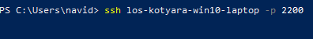
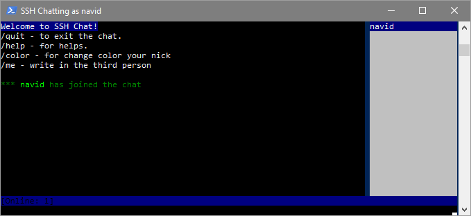
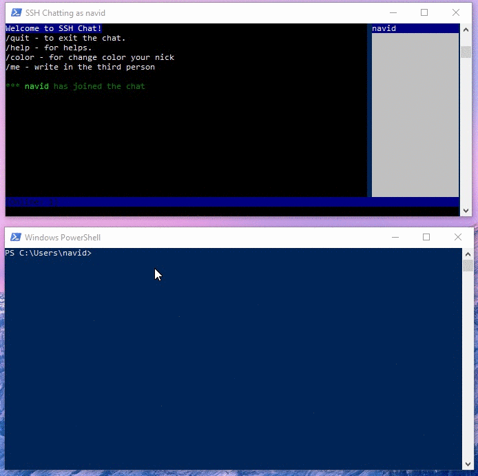
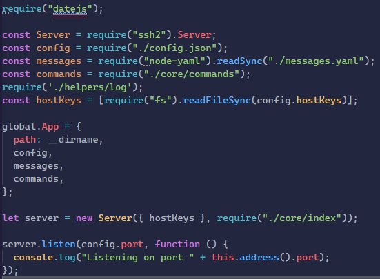
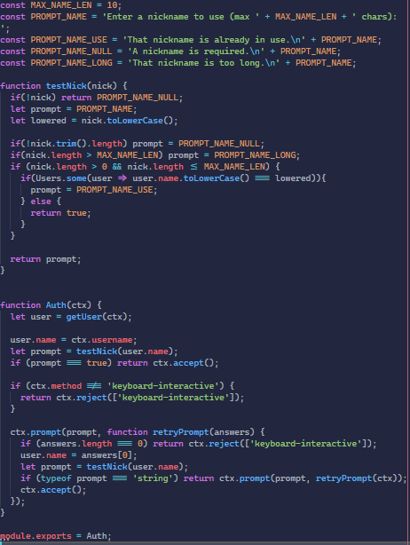
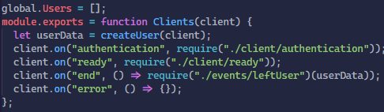
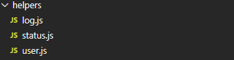
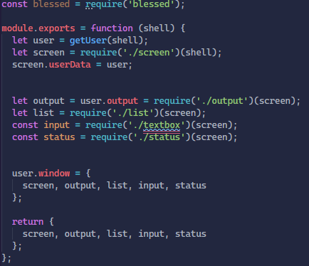

# Описание проекта

## Краткое описание программы

Наш проект представляет собой консольное приложение, ssh чат, в котором студенты группы могут обсуждать процесс обучения.

Процесс подключения к группе состоит из открытия терминала и подключения к беседе по ssh-адресу.

Здесь **los-kotyara-win10-laptop** это адрес ssh-сервера и **2200** это порт, на котором этот сервер работает.

После подключения пользователь видит консоль, в которой видны приветствие, несколько предыдущих сообщений и список пользователей.

Пример работы приложения

## Как это работает

Сама программа написана на языке JavaScript, фреймворк Node.JS

На машине сервера запускается программа, в которой подключается необходимый для создания ssh соединения пакет - ssh2. Затем загружаются необходимые конфигурации сервера, доступные команды, сообщения сервера для приветствия и описания доступных команд. Эти данные записываются в глобальную переменную, которая будет доступна из любой точки приложения. Сервер запускается на порте, указанном в файле конфигураций.

При подключении пользователя к серверу, производится создание объекта пользователя и обработчики событий для этого пользователя. Когда пользователь пытается войти в беседу запускается функция-обработчик авторизации. Сначала проверяется, допустим ли ник пользователя, и, если ник не доступен, предлагает ему ввести другой ник. Когда введён допустимый ник пользователь попадает в беседу.

Также описаны функции, выполняемые, когда пользователь готов к получению и отправке сообщений, когда пользователь выходит из чата и функция-заглушка, не приводящая к падению сервера, когда происходит какая-либо ошибка.

Были разработаны функции-помощники, которые позволяют, например, регистрировать всё, что происходит на сервере: подключение/отключение пользователей, сообщения и так далее.

Обработка оболочки терминала пользователей происходит на стороне сервера. При подключении и, например, изменении размера окна терминала, происходит обращение пользователя к серверу с целью отобразить все необходимые данные беседы.

## Дальнейшие планы

Ввиду того, что приложением будет пользоваться группа пользователей, необходимо добавление систем безопасности в виде парольного доступа, ввода правовой системы, хеширования паролей.

Также было в планах добавление в приложение ботов, например, бот, следящий за соблюдением правил чата, бот, проводящий викторины.

Предложенные добавления смогут улучшить пользовательский опыт и сделать его более безопасным.
